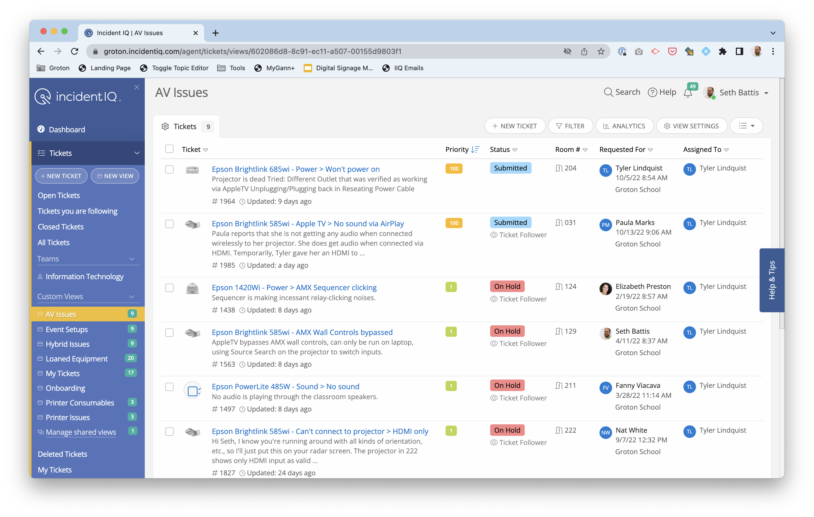
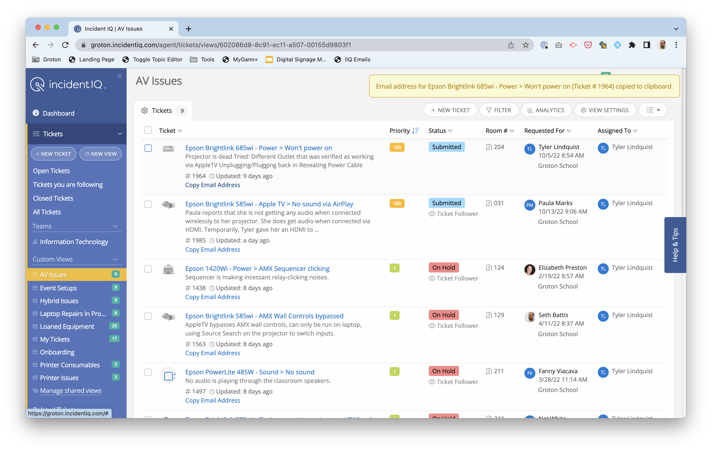

<link rel="stylesheet" href="https://cdnjs.cloudflare.com/ajax/libs/lightbox2/2.11.3/css/lightbox.min.css" integrity="sha512-ZKX+BvQihRJPA8CROKBhDNvoc2aDMOdAlcm7TUQY+35XYtrd3yh95QOOhsPDQY9QnKE0Wqag9y38OIgEvb88cA==" crossorigin="anonymous" referrerpolicy="no-referrer" />

Make it easy to copy the email for an IncidentIQ ticket to CC or forward email threads.

Easily generate a reliable link to a specific email in a particular inbox

## Install

<iframe
  src="https://groton-school.github.io/iiq-emails-bookmarklet/install.html"
  style="border: 0; height: 100px; width: 100%"
>
<a href="https://groton-school.github.io/iiq-emails-bookmarklet/install.html">Click here for installer</a>
</iframe>

## Use

When viewing any list of tickets in IncidentIQ, click the bookmarklet to enable the copy email links.

| Before                                                                                                                        | After                                                                                                                          |
| ----------------------------------------------------------------------------------------------------------------------------- | ------------------------------------------------------------------------------------------------------------------------------ |
|  |  |

## Known Limitations

[See open issues.](https://github.com/groton-school/iiq-emails-bookmarklet/issues)

